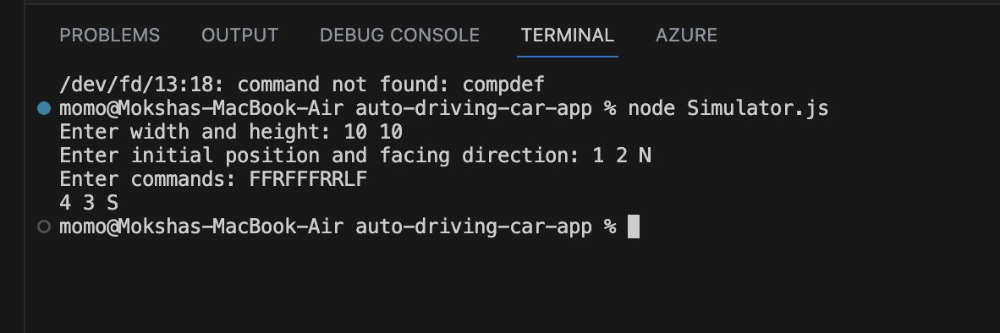
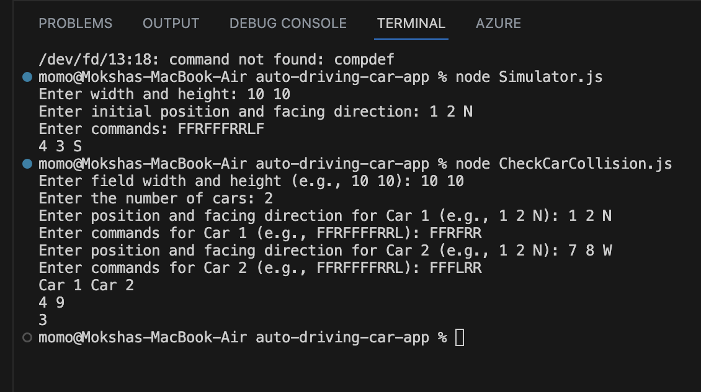

## Getting Started

To start with install jest from package.json by using:
```bash
npm install 
```

## Running from command line

### Part 1: 

For Part 1, run Simulator.js file in command Line as node Simular.js and enter input as shown below: 


```bash
node Simular.js
```




### Part 2: 

For Part 2, run CheckCarCollision.js file in command Line as node CheckCarCollision.js and enter input as shown below: 

```bash
node CheckCarCollision.js
```



## Run test cases

```bash
npm run test
```


